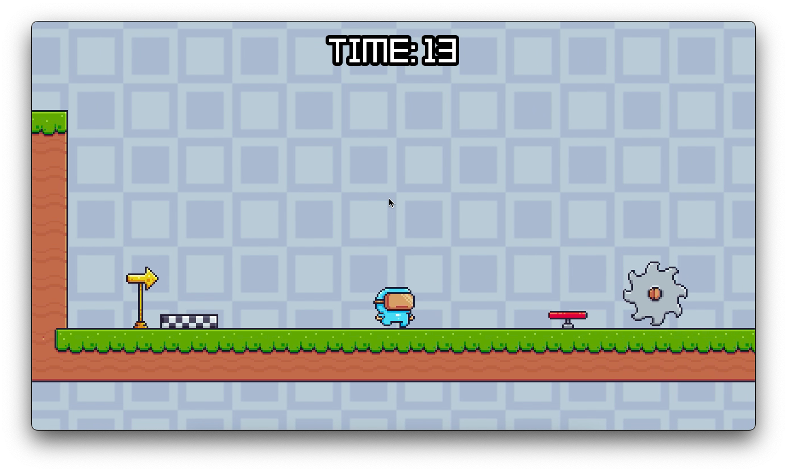
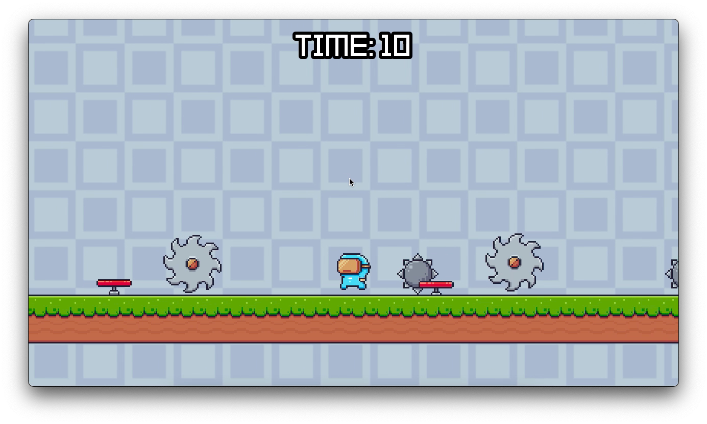
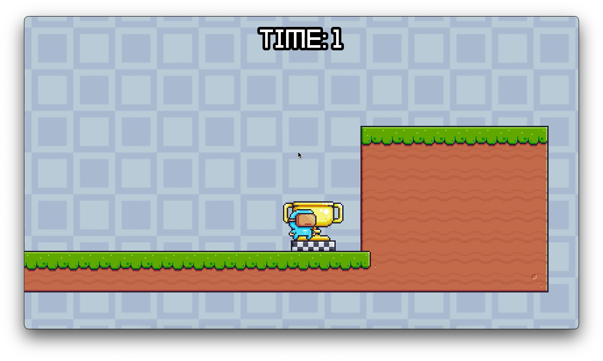
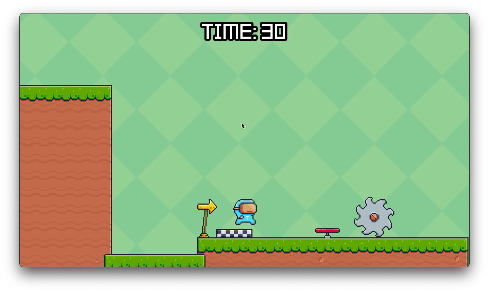

# 2D Game: Martian Mike

## Description

Welcome to Martian Mike, a tiny 2D platformer pixel art game written in Godot (C#)!

## Screenshots

## Gameplay

## How to Play

1. Download or Clone the source code.
2. Import the game in Godot. Build & Play.

## System Requirements

- OS: Windows 7/8/10 64 bit, macOS,
- CPU: Dual-core processor, 2.0 GHz
- RAM: 1GB
- Storage: 50 MB available space

## Credits

This game was made from an [Udemy Course](https://www.udemy.com/course/complete-godot-4-game-developer-2d-online-course/)

## Follow Me

- Twitter: [Twitter Handle](twitter.com/rprav_n)
- LinkedIn: [LinkedIn Handle](linkedin.com/in/rprav-n)

Happy gaming!
